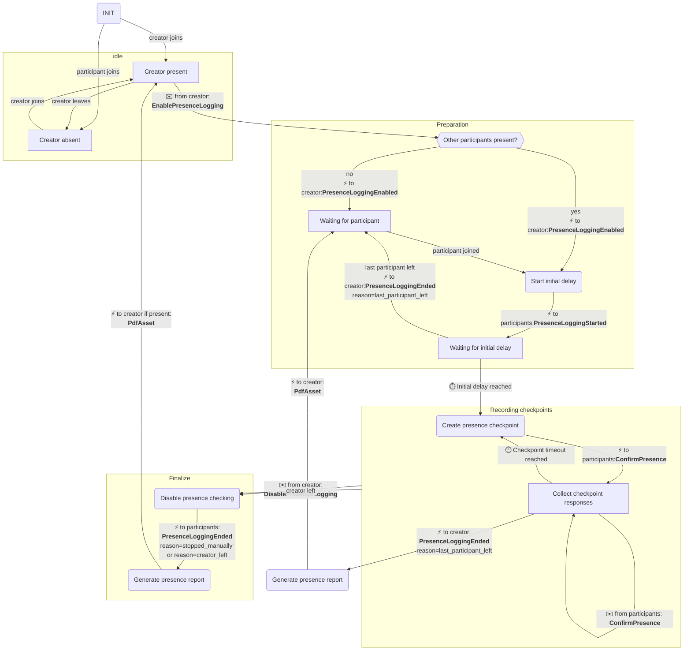

# Training Participation Report

## Overview

This module allows the creation of a participation report based of interactive
user feedback from participants.

The precondition is that the room creator is considered to be the trainer of the
course for which the participation is logged.

A participation report session can be enabled by a participant logged in as the
room owner, and will start as soon as at least one other participant is present
who is not the room owner. After a random amount of time within a predefined
range, the *initial checkpoint delay*, the first checkpoint is passed, and a
confirmation dialog is shown to all other participants. As soon as they press
the **Confirm** button, an entry of their presence is added to the log for that
checkpoint.

Repeatedly after another random amount of time within a predefined range, the
*checkpoint interval*, further checkpoints are passed, again bringing up the
confirmation dialog and storing log entries for each confirmation received from
the participants.

As soon as either no more room owner is present, no more other participant is
present, or the room owner sends the *disable presence logging* command, a
report is generated and stored as a file asset for the event.

## State diagram

## Signaling protocol namespace

Namespace for the signaling module: `training_participation_report`.

## Joining the room

### JoinSuccess

When joining a room, the `join_success` control event contains the module-specific fields described below.

#### Fields

| Field   | Type                        | Always | Description                                          |
| ------- | --------------------------- | ------ | ---------------------------------------------------- |
| `state` | `ParticipationLoggingState` | yes    | Current state of the participation logging procedure |

##### `ParticipationLoggingState`

- `disabled`: No participation logging is active, nothing to do for a client.
- `enabled`: Participation logging is enabled, either waiting for the initial timeout or the participant already confirmed the last checkpoint. A client should notify the participant about this state.
- `waiting_for_confirmation`: Participation logging is enabled, a checkpoint has already been passed and the newly joined participant can immediately confirm their presence.

### Joined

When joining a room, the `joined` control event sent to all other participants does not contain module-specific data.

## Commands

### EnablePresenceLogging

The `EnablePresenceLogging` action can be sent by the room creator to enable the presence logging. Presence logging will start immediately if at least one other participant is already in the meeting. If no other participant is present yet, presence logging will start as soon as the first other participant joins.

#### Fields

| Field                | Type     | Required | Description                         |
| -------------------- | -------- | -------- | ----------------------------------- |
| `action`             | `enum`   | yes      | Must be `"enable_presence_logging"` |
| `initial_checkpoint_delay` | `TimeRange` | no | The range for the number of minutes before the initial checkpoint is triggered (default: `{ "after": 600, "within": 1200 }`) |
| `checkpoint_interval` | `TimeRange` | no | The range for the number of minutes between the subsequent checkpoint is triggered (default: `{ "after": 6300, "within": 1800 }`) |

##### `TimeRange`

The `TimeRange` object contains these fields:

| Field    | Type    | Required | Description                                                                                                     |
| -------- | ------- | -------- | --------------------------------------------------------------------------------------------------------------- |
| `after`  | `int`   | yes      | The earliest number of seconds after which the checkpoint can be created. Must be a strictly positive number.   |
| `within` | `int`   | yes      | The number of seconds within which the checkpoint can be created after the `after` value. Must be 0 or greater. |

#### Response

The creator receives a [PresenceLoggingEnabled](#presenceloggingenabled) message as a confirmation.

Can return [Error](#error) of kind `insufficient_permissions`, `presence_logging_already_enabled`.

### DisablePresenceLogging

The `DisablePresenceLogging` action can be sent by the room creator to disable presence logging.

#### Fields

| Field                | Type     | Required | Description                          |
| -------------------- | -------- | -------- | ------------------------------------ |
| `action`             | `enum`   | yes      | Must be `"disable_presence_logging"` |

#### Response

The creator receives a [PresenceLoggingDisabled](#presenceloggingdisabled) message as a confirmation.

Can return [Error](#error) of kind `insufficient_permissions` or `presence_logging_not_enabled`.

### ConfirmPresence

The `ConfirmPresence` action can be sent by a participant to confirm their presence for the log.

#### Fields

| Field                | Type     | Required | Description                  |
| -------------------- | -------- | -------- | ---------------------------- |
| `action`             | `enum`   | yes      | Must be `"confirm_presence"` |

#### Response

The participant receives a [PresenceConfirmationLogged](#presenceconfirmationlogged) message as a confirmation.

Can return [Error](#error) of kind `presence_logging_not_allowed_for_participant` or `presence_logging_not_running`.

## Events

### PresenceLoggingEnabled

Direct response to [EnablePresenceLogging](#enablepresencelogging), sent to the creator only.

#### Fields

| Field                | Type     | Required | Description                     |
| -------------------- | -------- | -------- | ------------------------------- |
| `message`            | `enum`   | yes      | Is `"presence_logging_enabled"` |

### PresenceLoggingDisabled

Direct response to [DisablePresenceLogging](#disablepresencelogging), sent to the creator only.

#### Fields

| Field                | Type     | Required | Description                      |
| -------------------- | -------- | -------- | -------------------------------- |
| `message`            | `enum`   | yes      | Is `"presence_logging_disabled"` |

### PresenceLoggingStarted

Sent to all participants including the creator once the presence logging procedure has started and is waiting for the initial timeout to pass.

| Field                | Type     | Required | Description                                                                                              |
| -------------------- | -------- | -------- | -------------------------------------------------------------------------------------------------------- |
| `message`            | `enum`   | yes      | Is `"presence_logging_started"`                                                                          |
| `first_checkpoint`   | `String` | no       | RFC 3339 timestamp of when the first checkpoint starts. Only present in the message sent to the creator. |
| `reason`             | `Reason` | no       | Only present in the message sent to the creator. See below for allowed values.                           |

#### Reason

The `reason` field can be:

- `"autostart"` when the participation logging is configured to automatically start as soon as at least the creator and one other participant are present
- `"first_participant_joined"` when the creator enabled presence logging while they were alone in the room, and now the first participant joined
- `"started_manually"` when the creator started presence logging while other participants were already present

### PresenceLoggingEnded

Sent to all participants including the creator once the presence logging procedure ended

| Field                | Type     | Required | Description                                                    |
| -------------------- | -------- | -------- | -------------------------------------------------------------- |
| `message`            | `enum`   | yes      | Is `"presence_logging_ended"`                                  |
| `reason`             | `String` | no       | `last_participant_left`, `creator_left` or `stopped_manually`  |

### PresenceConfirmationRequested

Sent to all participants except the room creator as a request to confirm their presence.

| Field                | Type     | Required | Description                                               |
| -------------------- | -------- | -------- | --------------------------------------------------------- |
| `message`            | `enum`   | yes      | Is `"presence_confirmation_requested"`                    |

### PresenceConfirmationLogged

Sent to the frontend as a response to the [ConfirmPresence](#confirmpresence) message.

| Field                | Type     | Required | Description                                            |
| -------------------- | -------- | -------- | ------------------------------------------------------ |
| `message`            | `enum`   | yes      | Is `"presence_confirmation_logged"`                    |

### PdfAsset

Sent to the creator as soon as the training participant report has been generated and stored in the room assets.

| Field                | Type     | Required | Description                               |
| -------------------- | -------- | -------- | ----------------------------------------- |
| `message`            | `enum`   | yes      | Is `"pdf_asset"`                          |
| `filename`           | `string` | yes      | File name of the generated meeting report |
| `asset_id`           | `string` | yes      | Id of the created asset                   |

### Error

- `insufficient_permissions`: The sending client does not have the permission to perform the requested action.
- `presence_logging_already_enabled`: The creator attempted to enable presence logging when it was already enabled.
- `presence_logging_not_enabled`: A frontend attempted to perform an action that requires enabled presence logging when it wasn't enabled.
- `presence_logging_not_allowed_for_participant`: A participant who shouldn't confirm the presence attempted to do so.
- `storage_exceeded`: Storage was exceeded for the room when attempting to store the report.
- `generate`: Report generation has failed for an unspecified reason.
- `storage`: Storing the report has failed for an unspecified reason. One reason may be that the storage service is not reachable or misconfigured.
